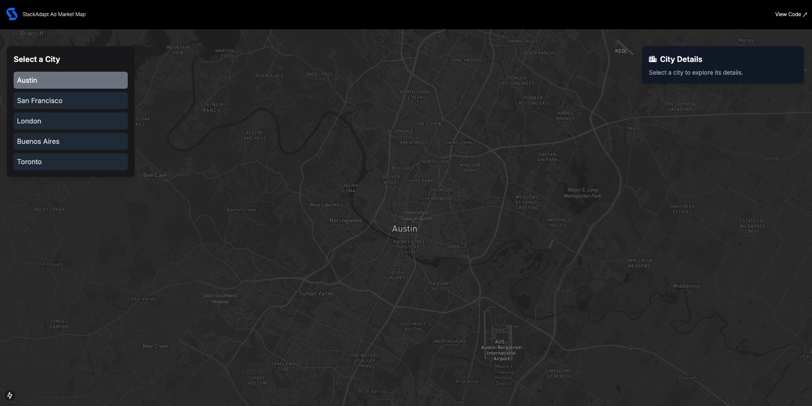
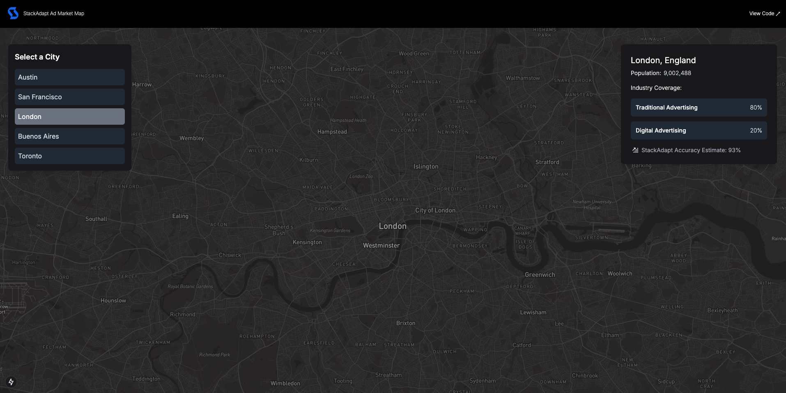

## StackAdapt Ad Market Map 

This concept project presents mock advertising metrics for a given market.

Link: [Live Demo](https://stackadapt-bonus.onrender.com)  

> Note: Please allow up to 30 seconds for the site to load - it's hosted for free. 

---

## Functionality

### 1. **Landing Page**  
Click on a city to view market data.

### 2. **View Data**  
View metrics for that city.

## Housekeeping

The data in the project is not vetted for accuracy. 